# Scotties


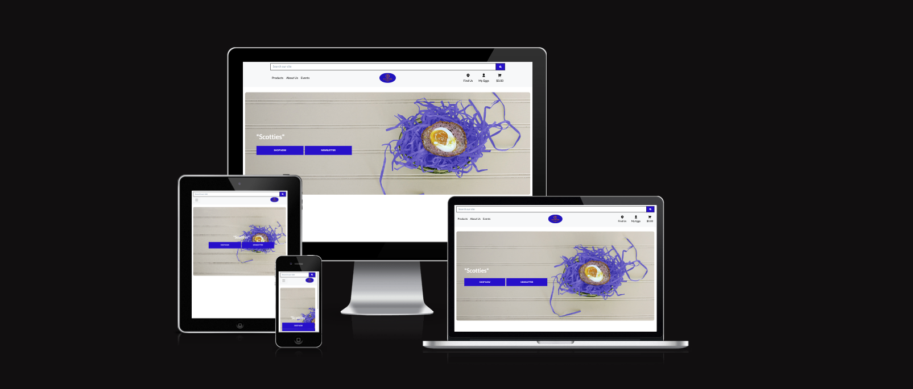


Scotties Hot Scotch Eggs is food truck based in Cambridge with an ecommerce website allowing customers to order freshly cooked items, subscribe to the newsletter, review the products and make a booking enquiry for events.

The website main goal is to allow users to view the menu and order some food.

Additionally the website wants to achieve allowing users to book the food truck for special events, sign up for newsletters, make reviews and also find the social media links to get the vans location updates.


Visit the deployed website [here](https://scotties.herokuapp.com/).


## Table of Contents

1. [User Experience (UX)](#user-experience-ux)
    1. [Strategy](#strategy)
        1. [Project Goals](#project-goals)
        2. [User Goals](#user-goals)
        3. [Strategy Table](#strategy-table)
    2. [Scope](#scope)
        1. [User Stories](#user-stories)
    3. [Structure](#structure)
        1. [Database Model](#database-model)
    4. [Skeleton](#skeleton)
        1. [Wireframes](#wireframes)
    5. [Surface](#surface)
        1. [Color Scheme](#color-scheme)
        2. [Typography](#typography)
2. [Marketing](#marketing)
   1. [Business Model](#business-model)
3. [Features](#features)
   1. [header](#Header)
   2. [home page](#home-page)
   3. [Products Page](#products-page)
   4. [Product Details Page](#product-details-page)
   5. [Products Admin](#products-admin)
   6. [Shopping Bag Page](#shopping-bag-page)
   7. [Checkout Page](#checkout-page)
   8. [Booking Page](#Booking-page)
   9. [Profile Page](#profile-page)
   10. [Accounts Pages](#accounts-pages)
   11. [404 Error Page](#404-error-page)
   12. [Product Reviews](#reviews)
4. [Technologies Used](#technologies-used)
    1. [Languages Used](#languages-used)
    2. [Libraries and Frameworks](#languages-and-frameworks)
    3. [Packages / Dependencies Installed](#packages--dependencies-installed)
    4. [Database Management](#database-management)
    5. [Payment Service](#payment-service)
    6. [Cloud Storage](#cloud-storage)
    7. [Tools and Programs](#tools-and-programs)
5. [Testing](#testing)
    1. [html](#html)
    2. [css](#css)
    3. [python](#python)
    4. [js](#js)
6. [Deployment](#deployment)
    1. [How To Use This Project](#how-to-use-this-project)  
    2. [Deployment to Heroku](#deployment-to-heroku)   
7. [Finished Product](#finished-product)
8. [Credits](#credits)
9. [Known Bugs](#known-bugs)
10. [Acknowledgements](#acknowledgements)


***


## User Experience (UX)


### Strategy


#### Project Goals

* Responsive design to make the website accessible on different screen sizes.

* Structure is easy to understand and navigates effortlessly for an easy shopping experience.

* The website design and colours are appealing to the customers.

* Customers are offered the opportunity to register an account.

* Easy shopping process to create a pleaseant experince for the customer.


#### User Goals

**Epic 1 - Shopping Experience**

* As a shopper, I want to easily find the products and their details.

* As a shopper, I want to view products on a specific category.

* As a shopper, I want to be able to search for products using specific keywords.

* As a shopper, I want to easily select the quantity of products to be purchased.

* As a shopper, I want to easily view the current purchase amount.

**Epic 2 - Shopping Bag and Checkout**

* As a shopper, I want to view all items currently on my shopping bag and be able to update them.

* As a shopper, I want to easily provide my shipping and payment information during the checkout.

* As a shopper, I want to receive an order confirmation once I have finished my purchase.

* As a shopper, I want to receive an order confirmation email for my records.

**Epic 3 - User Accounts**

* As a frequent shopper, I want to be able to register an account using my email address to be able to keep my records and interact with the website.

* As a frequent shopper, I want to receive a confirmation once my account has been registered to make sure the information entered was correctly.

* As a registered shopper, I want to easily log in and out from my account.

* As a registered shopper, I want to be able to recover access to my account in case I forget my password.

* As a registered shopper, I want to have a personalized profile page where I can keep my contact information updated and see my past orders.


**Epic 4 - Product Admin**

* As a site admin, I want to be able to add and update products.

* As a site admin, I want to be able to remove product no longer available.

**Epic 7 - Newsletter Subscription**

* As a site admin, I want shoppers to be able to provide their contact information to be able to reach out to them with information and offers.


#### Strategy Table

Opportunity / Problem | Importance | Viability / Feasibility
--- | --- | ---
Responsive design | 5 | 5
Create, edit and delete products | 5 | 5
Account registration | 5 | 5
User profile | 5 | 5
Save shipment information | 5 | 5
Product quick view | 3 | 2
Product details view | 5 | 5
Display current purchase total | 5 | 5
View current shopping cart | 5 | 5
Edit quantities inside the shopping bag | 4 | 4
Shopping cart quick view | 3 | 3
Card payment | 5 | 5
Newsletter subscription | 5 | 5

**Total** | **60** | **59**

### Scope

**First Phase**

* Responsive design

* Create, edit and delete products

* Account registration

* User profile

* Save shipment information

* Sort products by different criteria

* Search products by name or description

* Product details view

* Display current purchase total

* View current shopping cart

* Edit quantities inside the shopping bag

* Card payment

* Newsletter subscription


**Second Phase**

* Wishlist

* Rate products

* Write product reviews

* Pickup timeslot

**Third Phase**

* Product quick view

* Display similar products at the a product details view

* Shopping cart quick view

* Additional payment options

### User Stories

GitHub projects was used as my project management tool to track user stories. Using this helped to focus on specific tasks and track the project progress.

**Sprint 1**
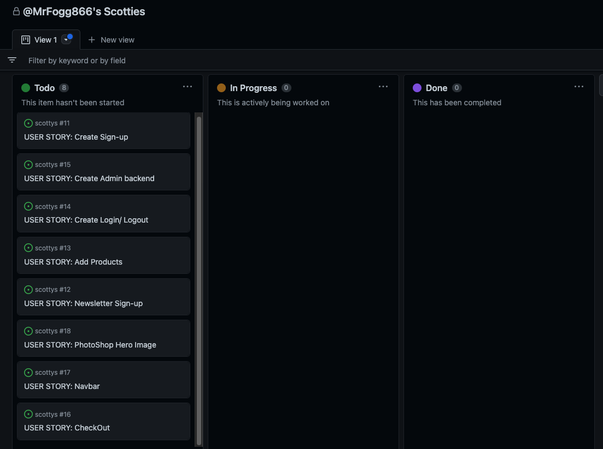 

**Sprint 2**
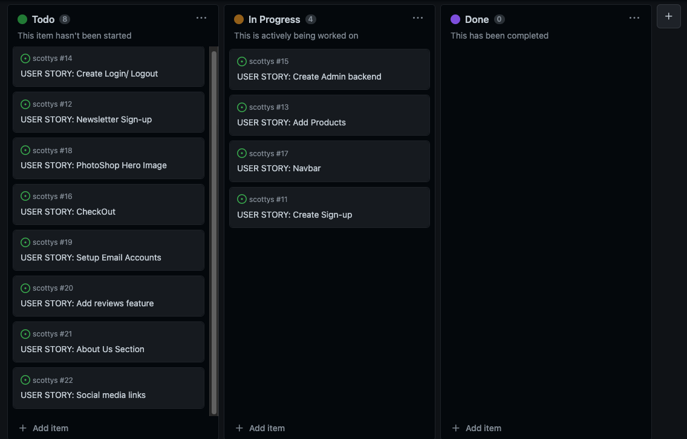 

**Sprint 3**
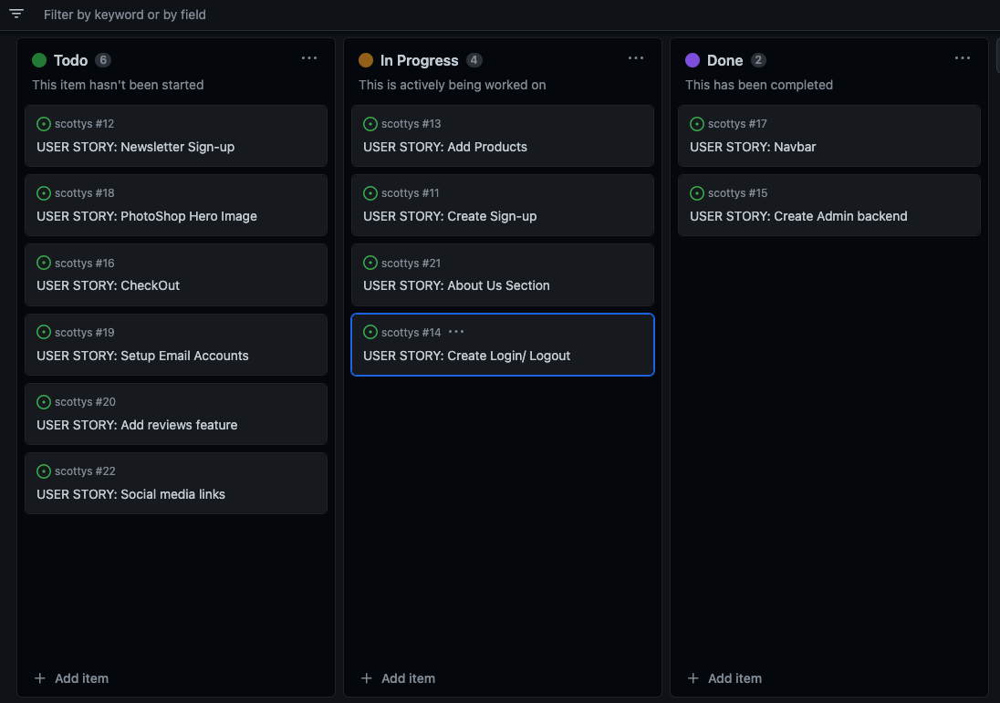 

**Sprint 4**
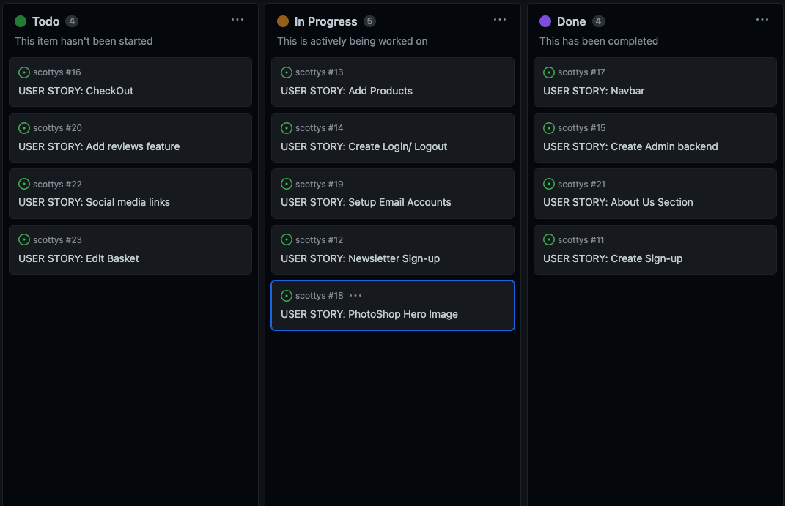 

**Sprint 5**
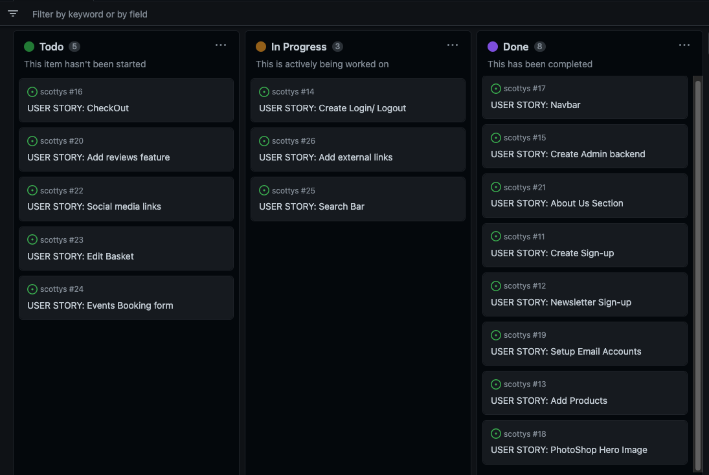 

**Sprint 6**
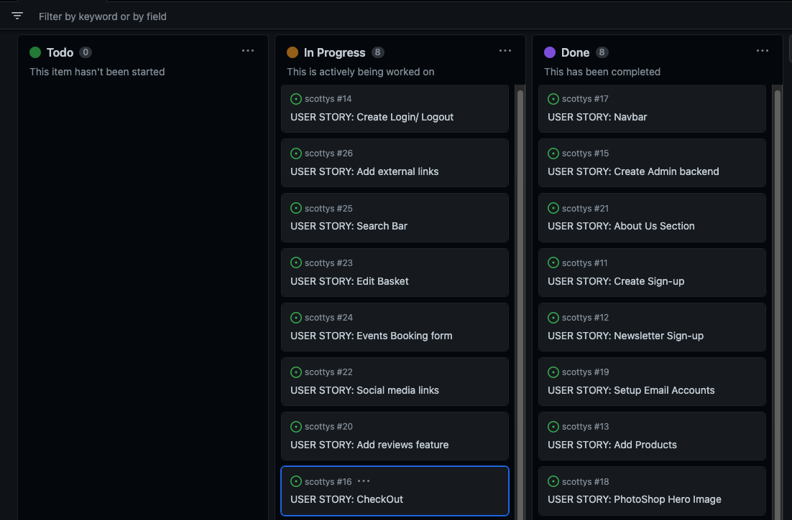 

**Sprint 7**
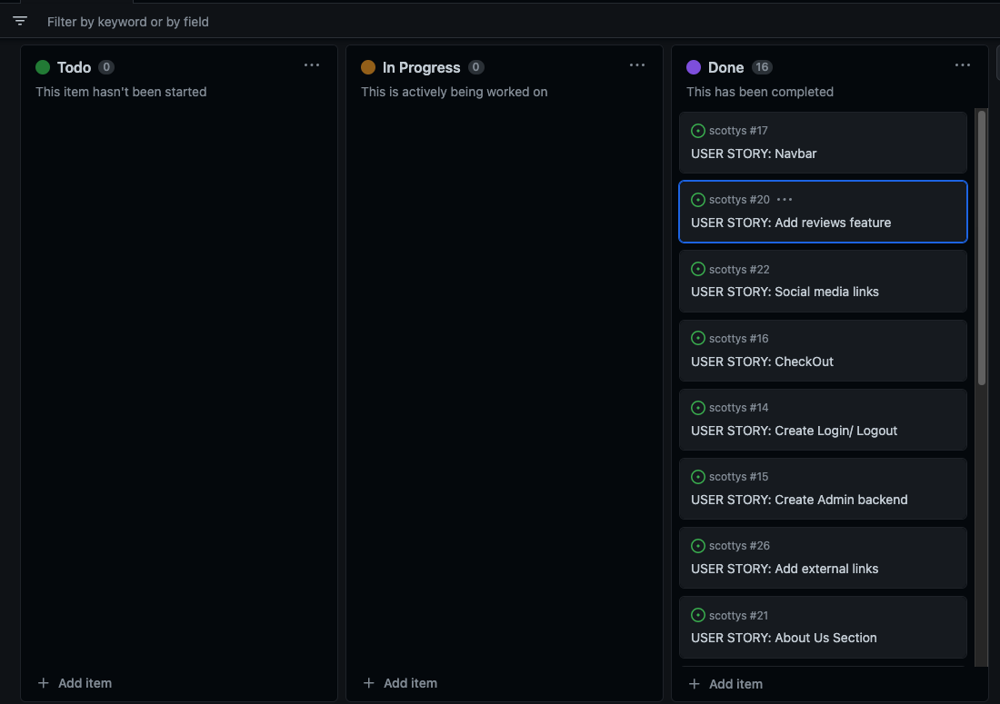 


### Structure

The website has been organized in a Hierarchical Tree Structure to ensure the site user navigates through the site effortlessly and intuitively. Here you can you can find the website map design, this was created using [powermapper](https://www.powermapper.com/)

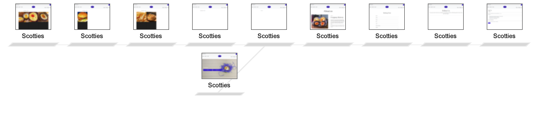

* Header, footer and navigation bar are consistent through all pages.

* Links and forms provide clear feedback to the site user.

* New additional content features are provided for the shopper once they register an account.

* A 404-error page is available.

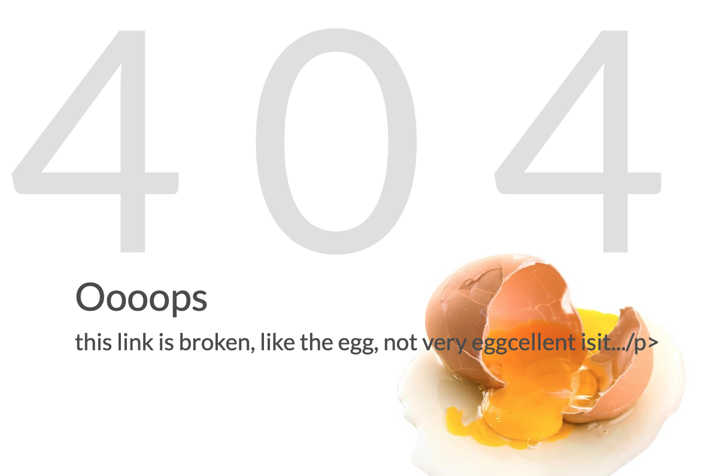


#### Database 

The type of database being used for the is relational database being managed using SQLite3 during development and managed using [PostgreSQL](https://www.postgresql.org/) within the deployed app help in [Heroku](https://www.heroku.com/) .

### Skeleton


#### Wireframes

[Balsamiq](https://balsamiq.com/) has been used to showcase the appearance of the site and display the placement of the different elements whitin the pages.

Page |
--- | 
Home | 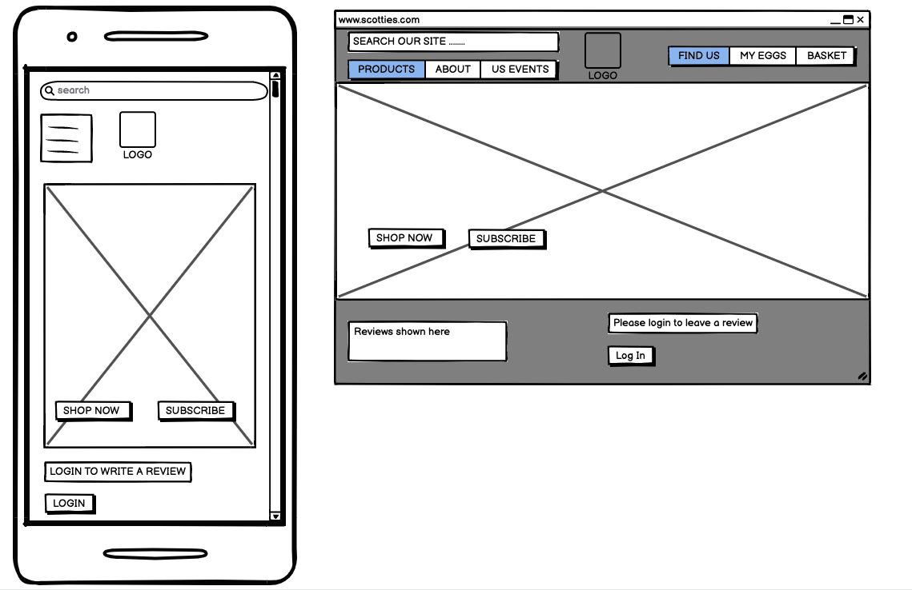 | 
Products | 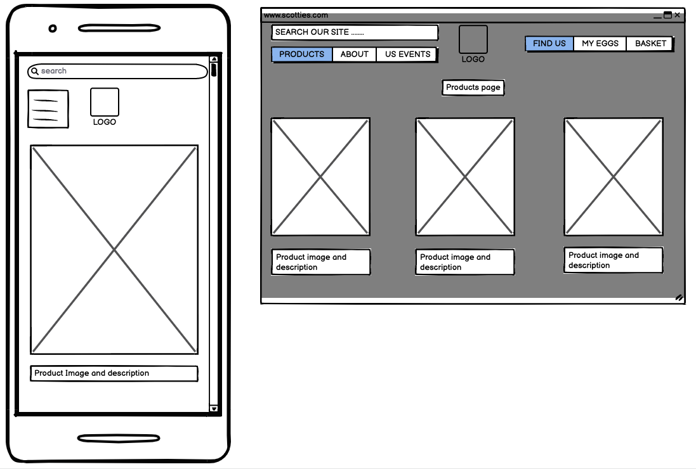 | 
Shopping Bag | 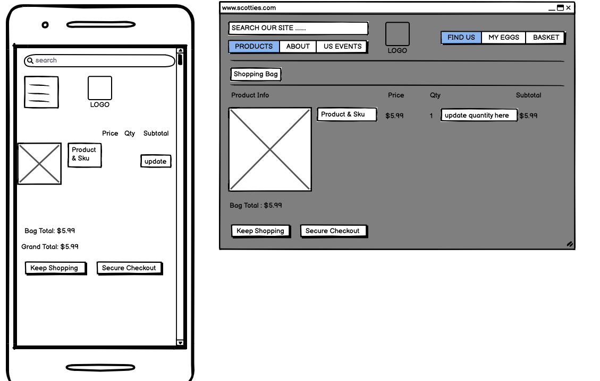 | 
Checkout | 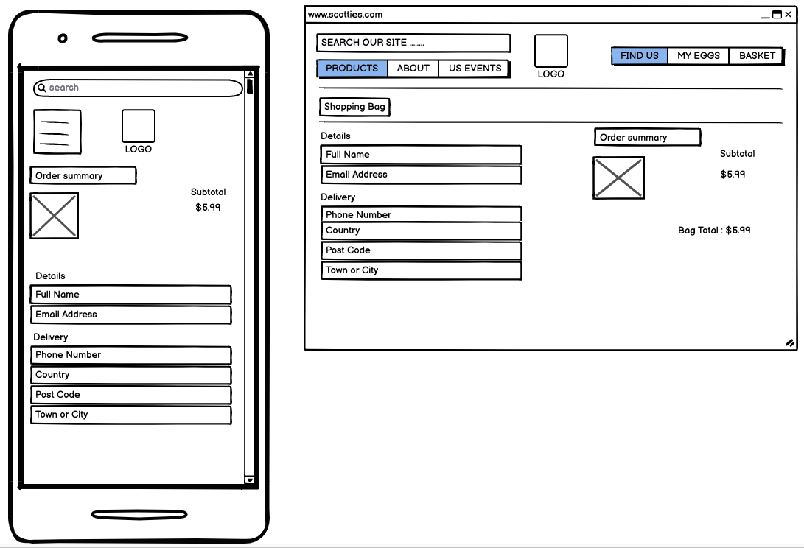 |
Profile | 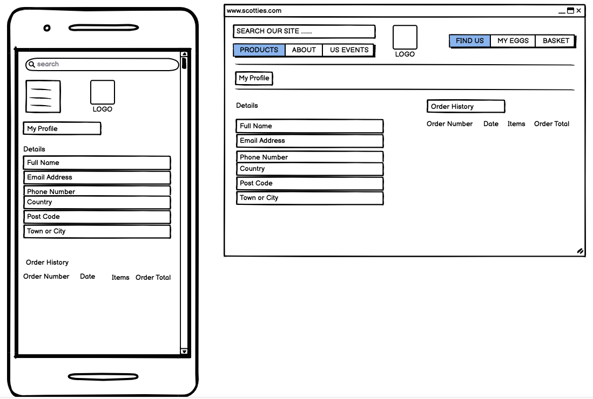 | 

### Surface


#### Color Scheme

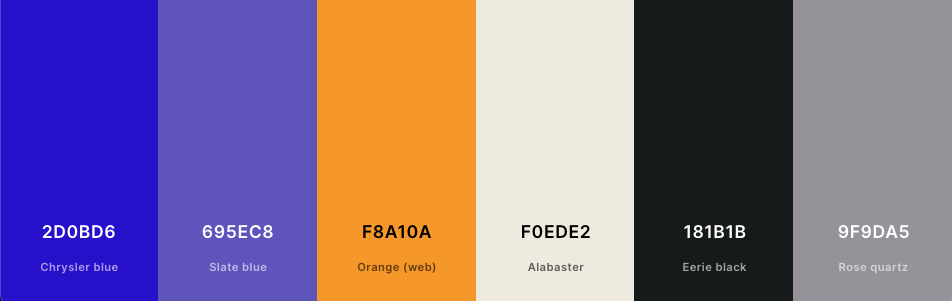

The colors used in the website are designed to match the company colours #2DOBD6 and #F8A10A as seen used on the foodtruck.

We use black (#181B1B) for the main text, main buttons, navbar links and other links, as well as in some dark backgrounds to create color contrast across the website.

For secondary buttons,  we use a Alabaster (#F0EDE2). As well as to highlight some of the text and titles.

Slate Blue (#695ec8) is  used for the colour of the shredded paper egg basket on the home page 

We used  white   (#fff) for the background and in text located within the dark backgrounds.


#### Typography

The font used across the whole site is Lato. It was used in two different weights.

[Back to top ⇧](#scotties)

### Marketing


#### Business Model

Scotties Hot Scotch Eggs  is a B2C company that offer our customers freshly cooked hot food from a mobile food truck in the Cambridgeshire area. We serve the best hot scotch eggs around, with various flavours of offer and a menu that changes seasonally.

#### Customers

Our main customers are millennials, singles and families who enjoy freshly cooked hot food and enjoy the food truck outdoor market experience.

#### Competitors

Theres is hundreds of food trucks serving great food, but  none in our area serving hot scotch eggs https://www.scotchandco.co.uk is a company we take inspiration from.

#### SWOT analysis

**Strengths**

* Owner is a Michelin level trained chef
* We are the only food truck doing scotch eggs in East Anglia
* True interest in providing top quality tasty food.

**Weaknesses**

* New brand
* Small marketing budget

**Opportunities**

* Too expand the range
* Open a deli

**Threats**

* Bad reviews
* increasing fuel and supply costs
* Bigger companies starting a franchise type scotch egg food truck

**Marketing Strategy**

Due to our small marketing budget, we have decided to start a Facebook Business page and interact with our customers. For our buying customers we have made it easy to sign up for our newsletter, in order to make them even more loyal and facilitate for them to share recipes and new products with their friends and family. Now, in this stage of starting a new company we rely a lot on “word of mouth” to attract more visitors for our foodtruck & homepage and more buying customers. 


**Facebook Business page**

See the live Facebook Business page [here](https://www.facebook.com/Scotties-Hot-Scotch-Eggs-108935481740254/).
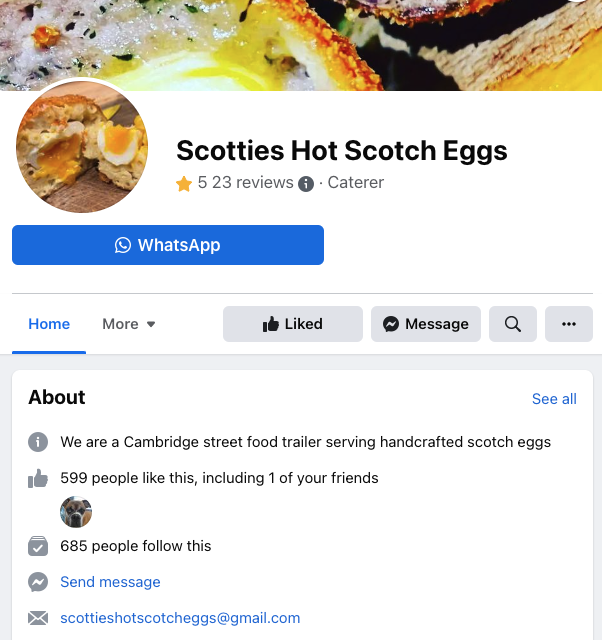

See the Instragram page here [here](https://instagram.com/scotties_hotscotch_eggs?igshid=YmMyMTA2M2Y=).
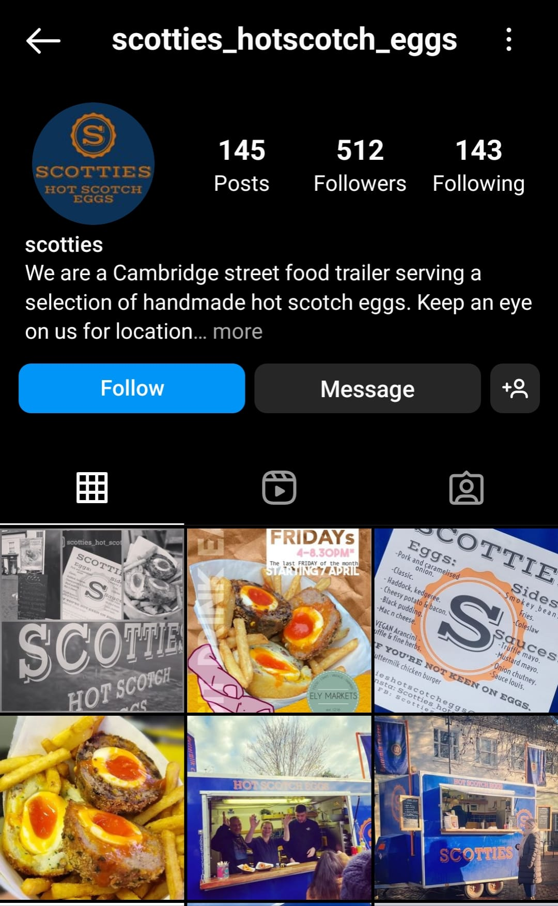

## Features


### General

* The website has been designed from a mobile first perspective.

* Responsive design across all device sizes.


#### Header
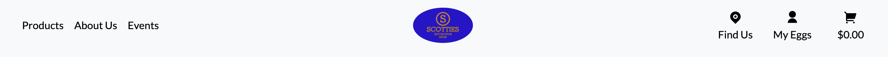

* The header contains the main logo, navigation links and search product functionality.

* The main logo works as a link to the home page.

* The navigation links allow the shopper access to all sections to facilitate navigation across the website. It also has a hover effect that changes color to provide feedback to the shopper for a better user experience.

* The shopping bag icon changes, reflecting the current status. The current shopping amount is displayed for the shopper.


#### Search Bar


* The search bar allows the user to search the website for products using specific keywords.

* The search bar is hidden at first for better visuals and can be toggled using the search icon link in case the shopper needs.

### Home Page


#### Categories Section

* Display to the shopper the product categories available, providing a link to each category.

#### About Section

* Provide relevant information to the shopper looking to learn more about our business.

#### Events Section

* Provides users a booking form and ability to request us for events.


* Provides users a confirmation message if details entered correctly

### Products Page

* Display all the products currently available or filtered on a specific category.

* Display an image of the products as well as their main information such as name, price and rating.

* Display the quantity of products currently being displayed.

* Provides a product navigation bar to allow the shopper to filter products per category.

* A link to the shopper favourite products is available on at the top of the page.

* Provides sorting functionality to sort products by price, rating, name or category.

* A back to the top button is available so the shopper can easily come back to the top of the page.

* Links to edit and remove are available for each product.

### Product Details Page

* The products navigation bar is present in case the shopper wants to go back to the products.

* Provide a larger image of the product and display its detailed information.

* A favourites icon is available to easily add the product to the shopper's favourite products.

* Allow the user to select the quantity of products to be added to the shopping bag.

* Provide a "Keep Shopping" button to go back to the products.

* An "Add to Bag" button is available to add the desired quantity of the product to the shopping bag.

* A reviews link is available, indicating how many reviews the product has received and to toggle the reviews. 

* All reviews the product has received are being displayed on the reviews section at the bottom of the page.

* Sort functionality allows the shopper to sort the products either by date created or rating.

* A link to leave a review is available at the bottom of the reviews.

* Provide edit and delete link for the logged in shopper's own reviews.


### Products Admin

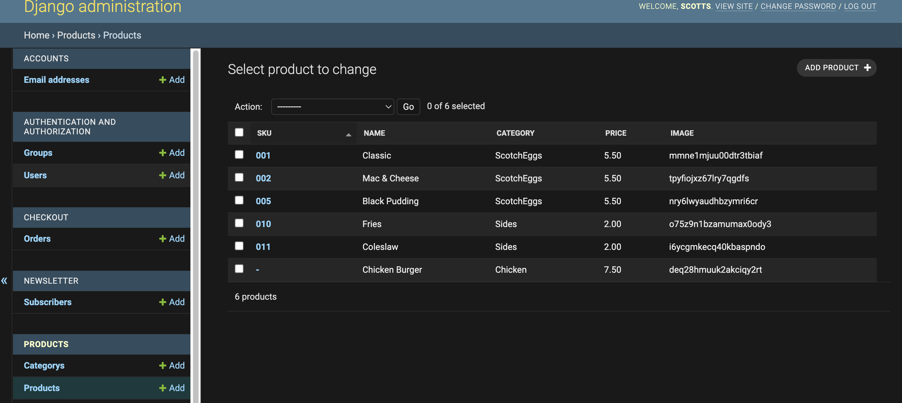

#### Add Product

* Provide a form for the site admin to be able to add new products to the store.

#### Edit Product

* Provide a prefilled form for the site admin to be able to update products in the store.

### Shopping Bag Page

* Display all products currently on the shopping bag and their information.

* Allow the user to update the product quantity or remove the product from the shopping bag.

* Display the current total cost including the bag total and delivery costs.

* Provide a "Keep Shopping" button to go back to the products.

* A button to checkout is provided for the shopper to finish the purchase.

### Checkout Page

* Provide a checkout form for the shopper to complete the purchase and provide the necessary contact, shipping and payment information.

* Display an order summary listing all the products to be purchased and their total cost including the bag total and delivery costs.

* Provide a link back to the shopping bag in the case the shopper would like to adjust the products in the shopping bag.

* A message is displayed, informing the shopper the amount to be charged on the provided card.

* Descriptive error messages are displayed in case there is any issue with the payment information provided.

* A button is clearly available for the shopper to complete the order.

* Stripe webhook handler is created in the backend to pass the order information in the case the browser crashes once the checkout completion.

### Booking Page

* here the user can enter information to request a booking

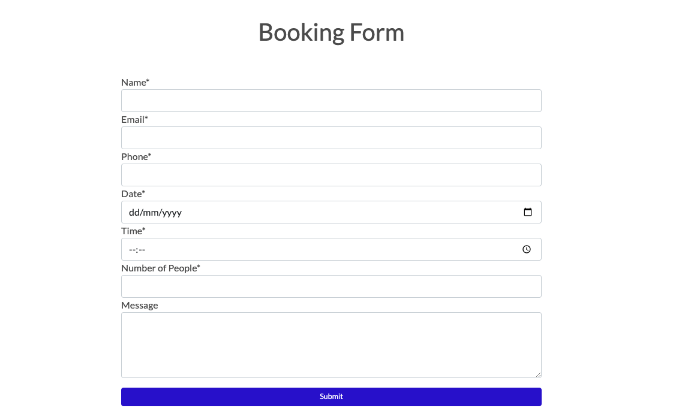

* this then gets sent to the gmail account of the website owner, who is then able to reply by email to confirm the event booking.

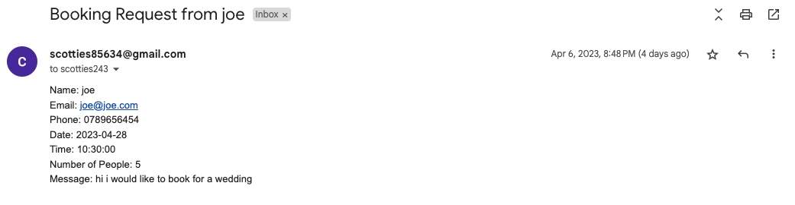


### Profile Page

* here the user can update there profile after creating an account

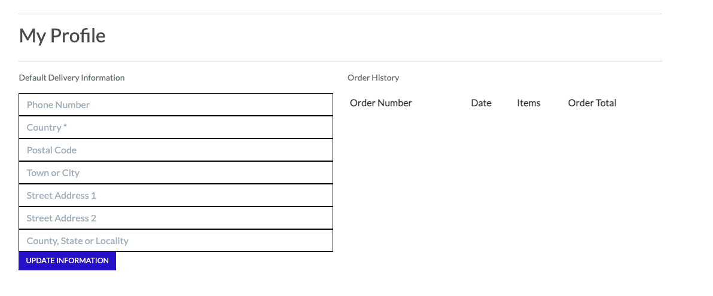

### Accounts Pages

Page | Purpose | Image |
--- | --- | --- |
Sign Up | Allow the shopper to sign up an account for the website. | 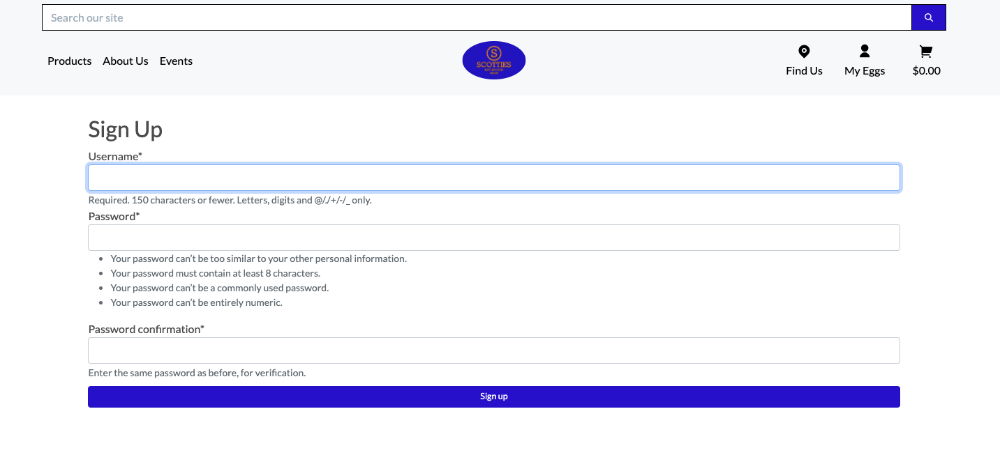 |
Sign In | Allow the registered shopper to sign in with their account. | 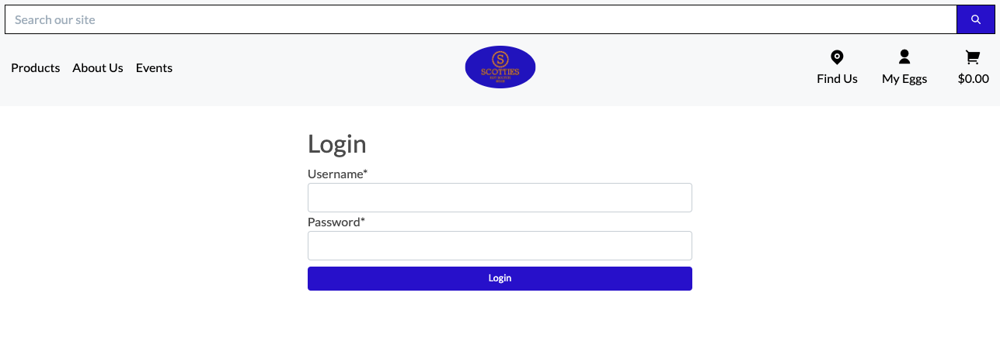 |
Sign Out | Allow the registered shopper to sign out from their account. | 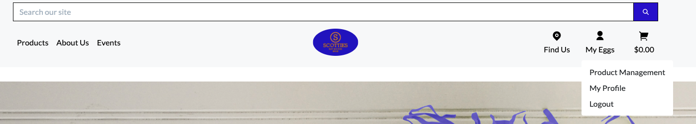 |

### 404 Error Page


* Provided information to the shopper in case the address entered cannot be found.

### Reviews

* Here is the form to make reviews, that is available once signed.

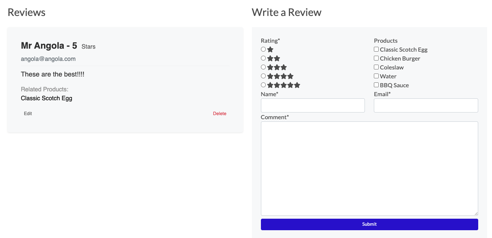

* The review will show on the homepage & next to the product.

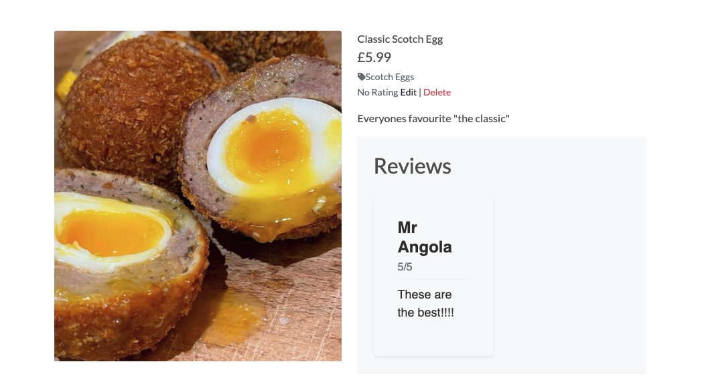

* Admin can edit these in the admin panal

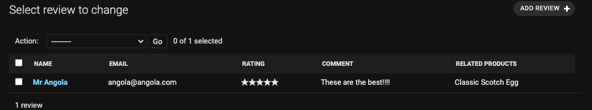

[Back to top ⇧](#scotties)


## Technologies Used


### Languages Used

* [HTML5](https://en.wikipedia.org/wiki/HTML)
* [CSS3](https://en.wikipedia.org/wiki/CSS)
* [JavaScript](https://en.wikipedia.org/wiki/JavaScript)
* [Python](https://en.wikipedia.org/wiki/Python_(programming_language))


### Libraries and Frameworks

* [Django](https://www.djangoproject.com/) was used as web framework.

* [Django Template](https://jinja.palletsprojects.com) was used as a templating language for Django to display backend data to HTML.
   
* [Bootstrap 5](https://getbootstrap.com/docs/5.0/getting-started/introduction/) was used throughout the website to help with styling and responsiveness.

* [Google Fonts](https://fonts.google.com) was used to import the font into the html file, and were used on all parts of the site.

* [Font Awesome](https://fontawesome.com) was used throughout the website to add icons for aesthetic and UX purposes. 

* [jQuery 3.6.0](https://jquery.com/) was used as a JavaScript library to help writing less JavaScript code. 

### Packages / Dependencies Installed

* [Django Allauth](https://django-allauth.readthedocs.io/en/latest/) was used for user authentication, registration, and account management.

* [Django Crispy Form](https://django-crispy-forms.readthedocs.io/en/latest/) was used to control the rendering of the forms. 

* [Django Countries](https://pypi.org/project/django-countries/) was used to provide country choices for use with forms and a country field for models.

* [Pillow](https://pypi.org/project/Pillow/) was used to add image processing capabilities.  

### Database Management


### Payment Service

   * [Stripe](https://stripe.com/en-gb-nl) was used to process all online payments transactions.


### Cloud Storage

### Tools and Programs

* [Git](https://git-scm.com)  
    * Git was used for version control by utilizing the Gitpod terminal to commit to Git and Push to GitHub. 

* [GitPod](https://gitpod.io/)
     * GitPod was used for writing code, committing, and then pushing to GitHub.

* [GitHub](https://github.com)  
   GitHub was used to store the projects code after being pushed from Git. 

* [Heroku](https://www.heroku.com)   
    * Heroku was used to deploy the website.

* [cloudinary](https://www.cloudinary.com)   
    * Cloudinary is used to hold images.    

* [photoshop](https://www.adobe.com)   
    * Photoshop was used to design the homepage image

* [Coolors](https://coolors.co)  
    * Coolors was used to create a color scheme for the website.

* [Balsamiq](https://balsamiq.com/)
     * Balsamiq was used to create the wireframes during the design phase of the project

* [Chrome DevTools](https://developer.chrome.com/docs/devtools/)
    * Chrome DevTools was used during development process for code review and to test responsiveness.

* [W3C Markup Validator](https://validator.w3.org/)
    * W3C Markup Validator was used to validate the HTML code.

* [W3C CSS Validator](https://jigsaw.w3.org/css-validator/)
    * W3C CSS Validator was used to validate the CSS code.

* [JSHint](https://jshint.com/) 
    * The JSHints JavaScript Code Quality Tool was used to validate the site's JavaScript code.

* [Favicon.io](https://favicon.io) was used to create the site favicon.

* [WebAIM](https://webaim.org/resources/contrastchecker/) was used to verify the contrast radio for the color on the website.

[Back to top ⇧](#scotties)


## Testing

### HTML

* [HTML Validator image](static/img/testhtml1.jpeg) | 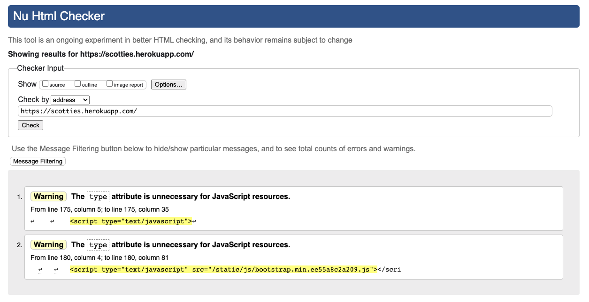 |

There were a few errors when i ran i ran the deployed project through the Nu Html Checker, and as you can see i removed these.

### CSS

* 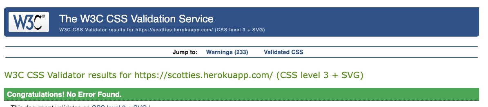 

No Errors here 


### PYTHON

* The pep8 debugger is currently out of action so i used (https://pep8ci.herokuapp.com/) to debug instead

* 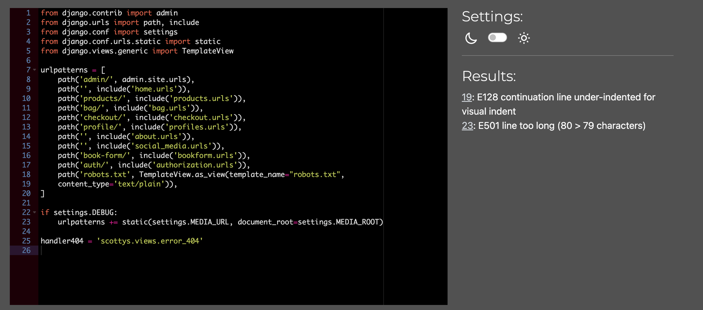 |

* After all bugs have been cleared

* 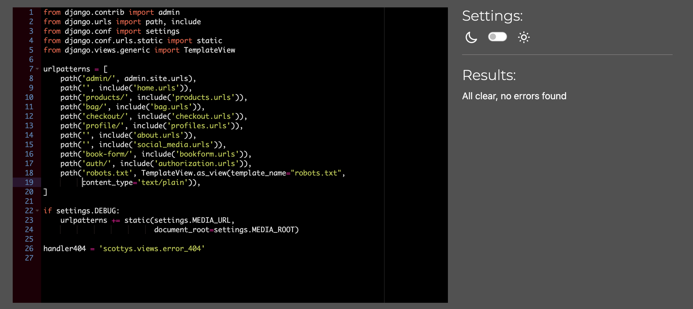 |


During development i would add this code to settings if debug was set to false, this then will show errors in the terminal. 

LOGGING = {
    'version': 1,
    'disable_existing_loggers': False,
    'handlers': {
        'console': {
            'class': 'logging.StreamHandler',
        },
    },
    'root': {
        'handlers': ['console'],
        'level': 'WARNING',
    },
}

## Deployment
 
The project was developed using[GitPod](https://gitpod.io/) workspace. The code was commited to [Git](https://git-scm.com/) and pushed to [GitHub](https://github.com/") using the terminal. The web application is deployed on Heroku as Github Pages is not able to host a Python project.

### How To Use This Project
To use and further develop this project you can either fork or clone the repository.  


#### Fork GitHub Repository
By forking the GitHub repository you can make a copy of the original repository on your GitHub account to view and/or make changes without affecting the original repository, by using the following steps:  

1. Log in to GitHub.  
2. Navigate to the main page of the GitHub Repository that you want to fork.  
3. At the top right of the Repository just below your profile picture, locate the "Fork" button.  
4. You should now have a copy of the original repository in your GitHub account.  
5. Changes made to the forked repository can be merged with the original repository via a pull request.  


#### Clone Github Repository
By cloning a GitHub repository you can create a local copy on your computer of the remote repository. The developer who clones a repository can synchronize their copy of the codebase with any updates made by fellow developers with push or pull request. Cloning is done by using the following steps:  

1. Log in to GitHub.  
2. Navigate to the main page of the GitHub Repository that you want to clone.  
3. Above the list of files, click the dropdown called "Code".  
4. To clone the repository using HTTPS, under "HTTPS", copy the link.  
5. Open Git Bash.  
6. Change the current working directory to the location where you want the cloned directory to be made.  
7. Type git clone, and then paste the URL you copied in Step 4.  
```$ git clone https://github.com/YOUR-USERNAME/YOUR-REPOSITORY```
8. Press Enter. Your local clone will be created.   
```
$ git clone https://github.com/YOUR-USERNAME/YOUR-REPOSITORY
> Cloning into `CI-Clone`...
> remote: Counting objects: 10, done.
> remote: Compressing objects: 100% (8/8), done.
> remove: Total 10 (delta 1), reused 10 (delta 1)
> Unpacking objects: 100% (10/10), done.
```  
Changes made on the local machine (cloned repository) can be pushed to the upstream repository directly if you have a write access for the repository. Otherwise, the changes made in the cloned repository are first pushed to the forked repository, and then a pull request is created.  
Click [Here](https://docs.github.com/en/github/creating-cloning-and-archiving-repositories/cloning-a-repository-from-github/cloning-a-repository) to retrieve pictures for some of the buttons and more detailed explanations of the above process.  

#### Project Set Up After Forking or Cloning  
1. Install all dependencies by typing in the CLI ```pip3 install -r requirements.txt```  
2. Create a ```.gitignore``` file and ```env.py``` file in the project's root directory. Add the ```env.py``` file to ```.gitignore```. 
3. Inside the env.py file, enter the project's environment variables:   
   ```
   import os

   os.environ.setdefault("SECRET_KEY", <your_secret_key>)
   os.environ.setdefault("DEVELOPMENT", '1')
   os.environ.setdefault("STRIPE_PUBLIC_KEY", <your_key>)
   os.environ.setdefault("STRIPE_SECRET_KEY", <your_key>)
   os.environ.setdefault("STRIPE_WH_SECRET", <your_key>)
   ```   
   You can get the keys from:
   - "SECRET_KEY" can be generated using [Django Secret Key Generator](https://miniwebtool.com/django-secret-key-generator/)   
   - "STRIPE_PUBLIC_KEY" and "STRIPE_SECRET_KEY" can be generated by creating a stripe account. The keys are found in 'Developers' Section, under 'API Keys'.  
   - In the Developer Section, under 'Webhooks', add a new endpoint.  "STRIPE_WH_SECRET". On Endpoint URL, enter:  
   ``` https://<your_host_url>/checkout/wh/ ```   
   Select to listen to all events, and create endpoint, and you can view your "STRIPE_WH_SECRET".   

4. Make migrations to setup the inital database operations.  
   ``` 
   python3 manage.py makemigrations 
   python3 manage.py migrate 
   ```   
5. Load data for the database or create data manually. 
   ```
   python3 manage.py loaddata <app_name>
   ``` 
6. Create a super user.
   ```
   python3 manage.py create superuser
   ```  
The project should now complete to run and can now be used for development. To run the project, type in the CLI terminal: ```python3 manage.py runserver```     


Page | Desktop | Mobile |
--- | --- | --- |
| Home | 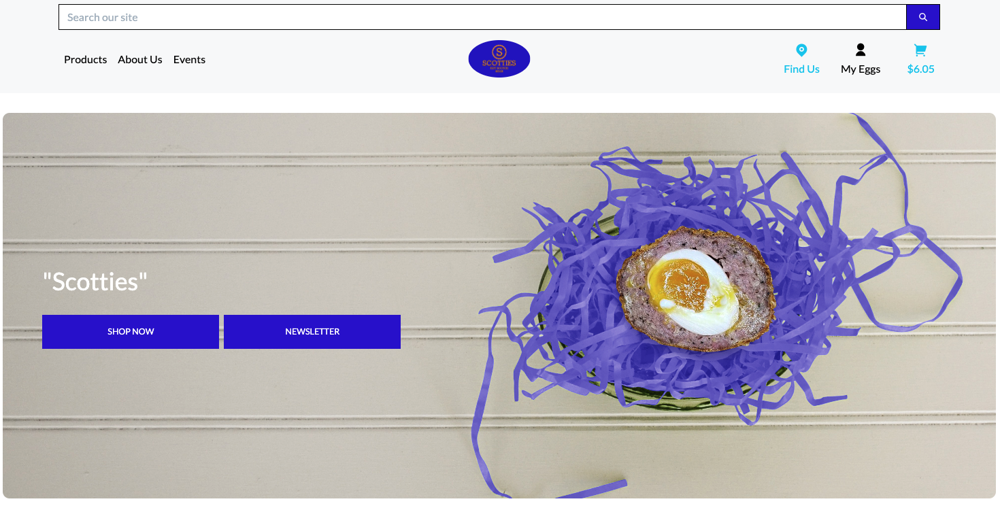 | 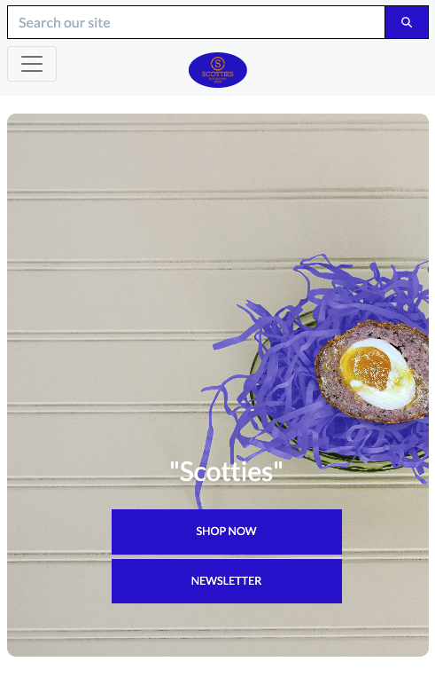 |
| About Us | 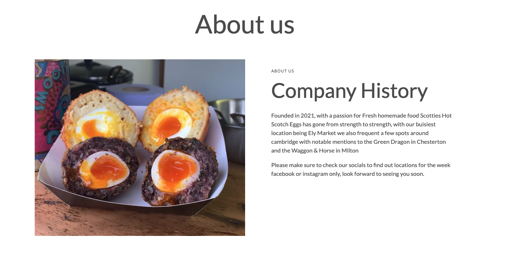 | 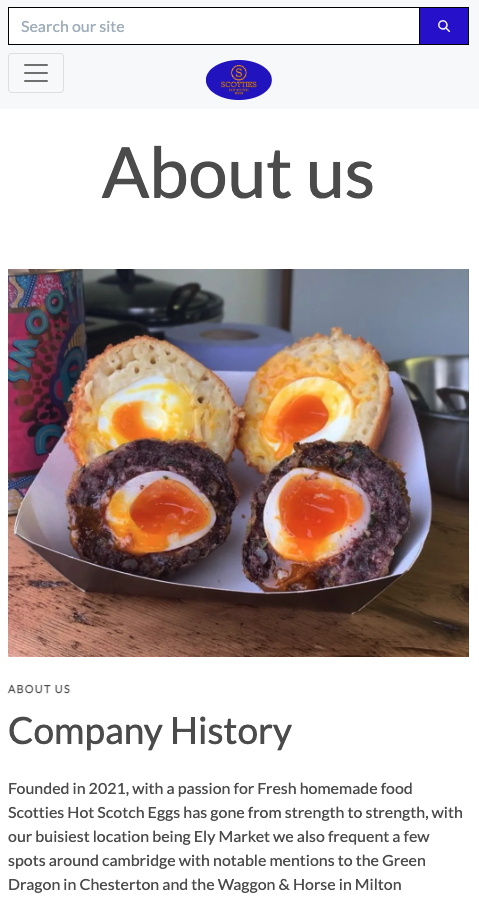 |
| Products | 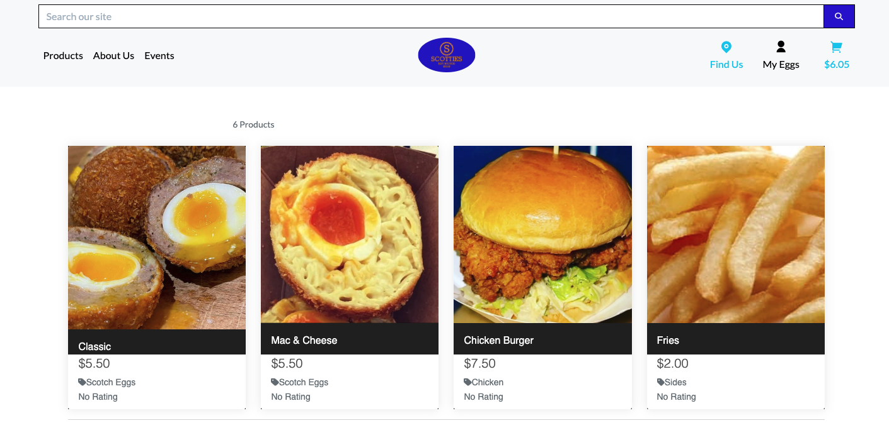 | 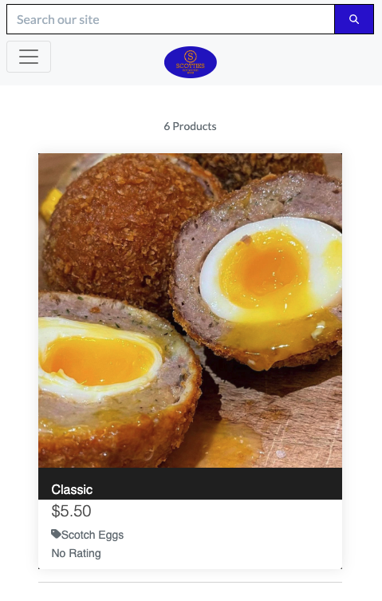 |
| Shopping Bag | 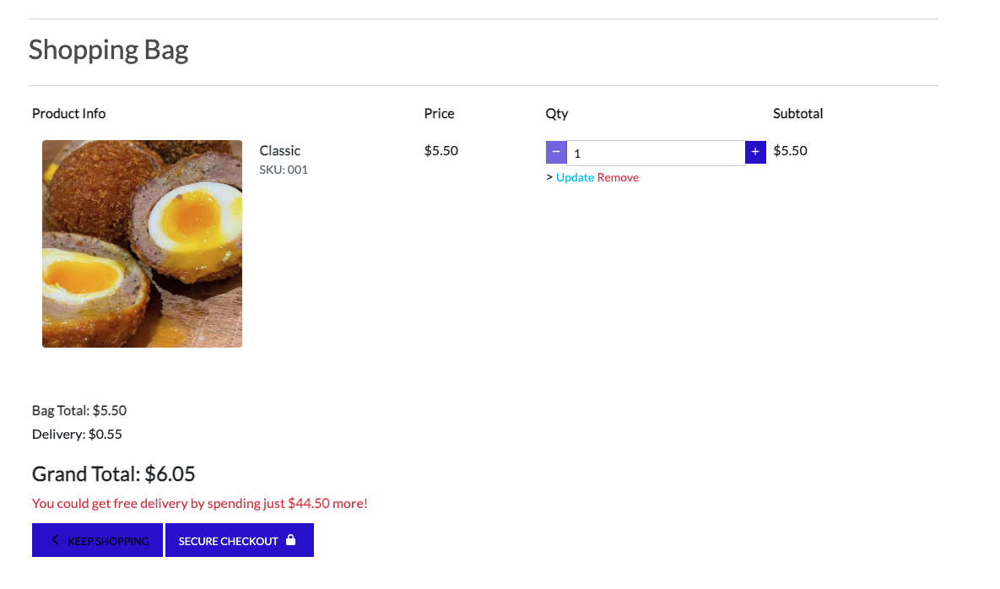 | 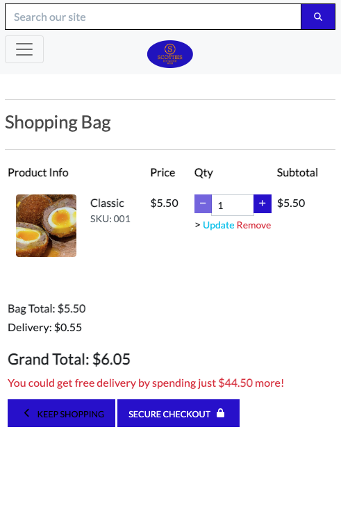 |
| Search | 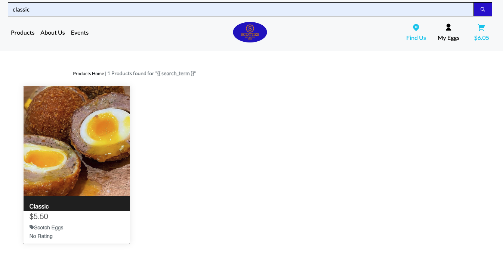 | 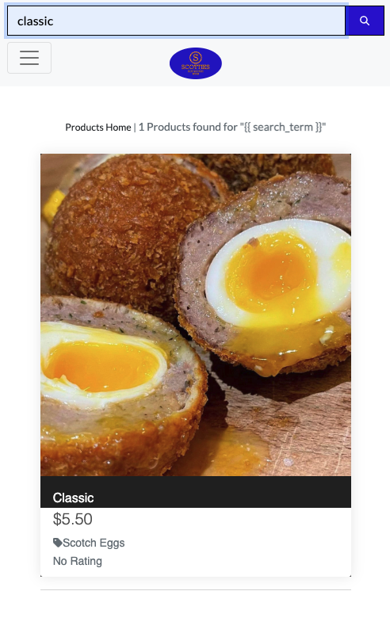 |


[Back to top ⇧](#scotties)


### Media

* All images are owned by Scotties Hot Scotch Eggs 


### Code

* The code in Code Institute's video on the Boutique Ado project was used as the main reference point to set up an e-commerce / online store project using HTML, CSS, JS, Python+Django, PostgreSQL database, Stripe

## Known Bugs

*  the prices are currently displayed in $USD and will need to be changed into GBP

[Back to top ⇧](#scotties)

## Acknowledgements

* My tutor, Marcel, for his invaluable support, feedback and guidance through the whole process.

* Code Institute and it's amazing Slack community for their support and providing me with the necessary knowledge to complete this project.

[Back to top ⇧](#scotties)
